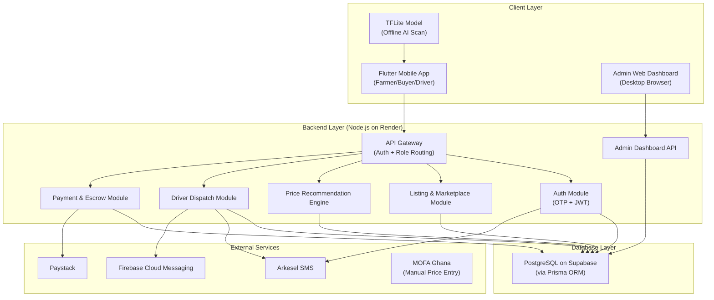
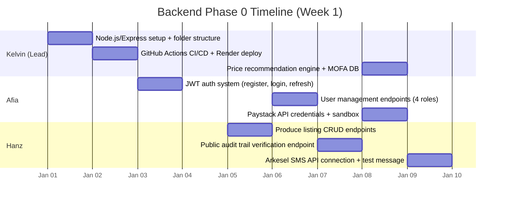
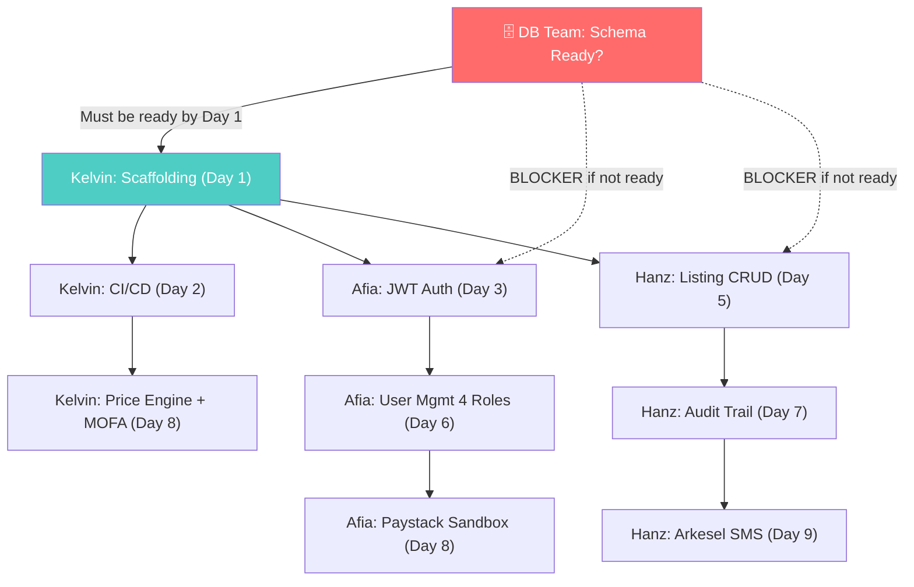
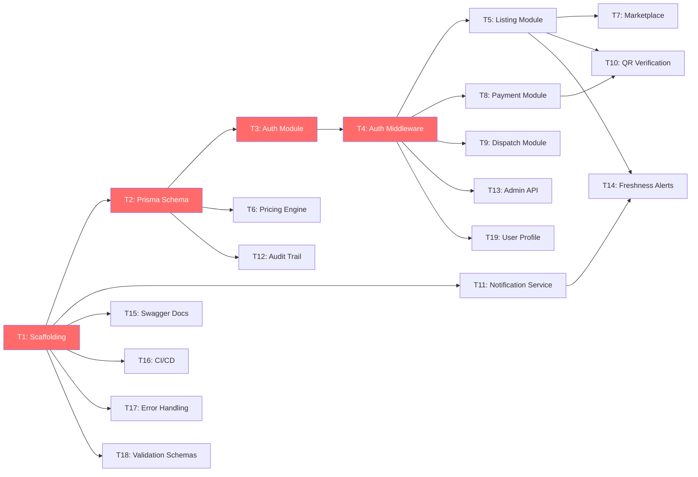

# AgriConnect — Backend Lead Comprehensive Analysis

> **Analysis based on:** AgriConnect Phase 0.pdf, AgriConnect SRS Document.pdf, AgriConnect Software Design.pdf, User Flow Document.pdf
>
> **Prepared for:** Backend Lead
>
> **Date:** Day 2026

---

## 1. Project Overview

### 1.1 What Is AgriConnect?

AgriConnect is a **freshness-aware agricultural marketplace** — a mobile application designed to reduce **post-harvest losses** among **smallholder farmers in Ghana** by connecting them directly to verified buyers and truck drivers, **eliminating middlemen**.

> **Source:** SRS Document, Section 1.1 – "…an agricultural marketplace designed to reduce post-harvest losses among farmers in Ghana by connecting the farmers directly to buyers without the need for middlemen."

### 1.2 The Problem It Solves

| Current Problem | How AgriConnect Solves It |
|---|---|
| Farmers harvest produce, wait for middlemen, and accept exploitative prices under time pressure | Farmers list produce directly on a marketplace with AI-verified freshness scores and price recommendations |
| No objective quality signal exists to support price negotiation or remote buyer trust | On-device AI model scans produce and generates a freshness score (0–100%) and estimated shelf life in days |
| Buyers have no visibility into available produce, quantity, or freshness across regions | Buyers browse a marketplace with filters (freshness, crop type, region, quantity) and see AI-verified quality |
| Transport is arranged through personal contacts with no coordination mechanism | Automated driver dispatch matches the nearest available driver whose truck capacity meets the order |
| Payments are made in cash with no verifiable record | Mobile Money escrow via Paystack — funds held until delivery confirmed via QR code verification |

> **Source:** SRS Document, Section 2.1 – "Current Process" and "Proposed System"

### 1.3 Target Users

| User Role | Description | Skill Level |
|---|---|---|
| **Farmer** | Ghanaian smallholder farmers who scan, list, and sell produce | Limited formal education; basic smartphone familiarity; no prior digital marketplace experience |
| **Buyer** | Market traders, restaurant operators, food processors, institutional buyers | Basic smartphone + Mobile Money literacy; commercially oriented |
| **Truck Driver** | Registered drivers with vehicle capacity and operating region on file | Familiar with Ghanaian road networks; registered in advance |
| **System Administrator** | Web-based dashboard operator | Basic computer literacy with web browser access |

> **Source:** SRS Document, Section 2.3

### 1.4 Core Features

1. **AI Crop Freshness Detection** — On-device TFLite (MobileNetV2) model runs offline, returns freshness score (0–100%) and shelf life in days
2. **Produce Listing & Price Recommendation** — Farmer creates listing; backend generates SHA-256 hash, QR code, and price recommendation (ceiling from MOFA price × freshness, soft floor at 60% of MOFA reference)
3. **Buyer Marketplace** — Browse, filter (freshness, crop type, region, quantity), sort, and purchase
4. **Payment Processing** — Paystack Mobile Money escrow; funds held in platform account; released on QR-verified delivery
5. **Automated Transport Dispatch** — Nearest available driver matched by truck capacity and proximity; accept/decline with auto-reassignment
6. **Tamper-Proof Audit Trail** — Every event from scan to delivery is SHA-256 hashed and timestamped

> **Source:** SRS Document, Section 2.2; Software Design, Section 1.2; User Flow Document

### 1.5 How the System Parts Work Together



**Key architectural decisions:**
- The AI model runs **entirely on-device** (offline) — the backend never receives raw images
- The backend receives only the **freshness score and metadata** when a farmer creates a listing
- All external services (Paystack, Arkesel, FCM) are called **only by the backend** — the Flutter app never calls them directly
- The database is accessed **exclusively through Prisma ORM** from the backend — no direct client access

> **Source:** Software Design, Sections 1.1–1.4

---

## 2. Technology Stack Review

### 2.1 Proposed Stack (from PDFs)

| Layer | Technology | Source |
|---|---|---|
| Mobile App | Flutter | Software Design, Section 1.1 |
| AI Model | TensorFlow Lite (MobileNetV2) | Software Design, Section 1.1; SRS Section 2.4 |
| Backend Runtime | Node.js | SRS Section 2.4 |
| Database | PostgreSQL hosted on Supabase | Software Design, Section 1.3; SRS Section 2.4 |
| ORM | Prisma | Software Design, Section 1.3 |
| Hosting/Deployment | Render.com with GitHub Actions | Software Design, Section 1.2 |
| Payment Gateway | Paystack API | SRS Section 2.5; Software Design Section 1.4 |
| SMS Provider | Arkesel Ghana SMS API | SRS Section 2.5; Software Design Section 1.4 |
| Push Notifications | Firebase Cloud Messaging (FCM) | Software Design, Section 1.4 |
| Price Data | MOFA Ghana (manual entry by admin) | Software Design, Section 1.4; User Flow Document |

> [!NOTE]
> The PDFs do **not** explicitly state a backend framework (e.g., Express.js, Fastify, NestJS). They only say "Node.js runtime environment." The PDFs also do **not** specify an authentication token strategy (JWT vs. session), though the auth module mentions "authentication issuance and refresh" which implies JWT.

### 2.2 Suitability Assessment

#### ✅ Strengths

| Technology | Assessment |
|---|---|
| **Node.js** | Excellent for I/O-heavy API workloads. The AgriConnect backend is primarily request routing, database CRUD, and external API calls — Node.js handles this efficiently. Massive ecosystem and easy hiring. |
| **PostgreSQL** | Perfect choice for a transactional system with financial records, audit trails, and relational data (users → profiles → listings → transactions). Strong data integrity guarantees. |
| **Supabase** | Good managed PostgreSQL hosting with built-in auth, realtime, and storage capabilities. Free tier suitable for MVP/academic projects. Reduces DevOps burden. |
| **Prisma ORM** | Excellent type-safe ORM for Node.js. Schema-as-code approach with migrations aligns perfectly with team collaboration. Auto-generates TypeScript types. |
| **Render.com** | Suitable for student/MVP deployment. Auto-deploy from GitHub. Free tier available. Simple setup. |
| **Paystack** | The correct choice for Ghana — supports MTN Mobile Money and Vodafone Cash natively. Well-documented API. Supports split payments and escrow-like workflows. |
| **Arkesel** | Ghana-specific SMS provider. Reliable for OTP delivery and driver notifications in the Ghanaian market. |
| **FCM** | Industry standard for push notifications. Free. Works seamlessly with Flutter. |
| **Flutter** | Cross-platform (Android + iOS) with excellent TFLite integration. Suitable for the target market. |

#### ⚠️ Limitations & Risks

| Area | Risk | Severity | Recommendation |
|---|---|---|---|
| **Render Free Tier** | Services spin down after 15 minutes of inactivity. Cold start takes 30–60 seconds. Unsuitable for production with real farmers. | 🔴 High | Use Render's paid tier ($7/mo) or migrate to Railway/Fly.io for always-on. For academic demo, document this limitation. |
| **Supabase Free Tier** | 500 MB database, 1 GB storage, pauses after 1 week of inactivity. | 🟡 Medium | Acceptable for development/demo. Plan upgrade path for any real deployment. |
| **No Framework Specified** | Raw Node.js without Express/Fastify means the team must decide on routing, middleware, error handling, validation. | 🔴 High | **Select a framework immediately.** Recommend **Express.js** (most accessible) or **NestJS** (more structured, better for large teams). |
| **Escrow via Paystack** | Paystack does not offer true escrow out-of-the-box. The "hold funds and release on delivery" pattern requires careful implementation — likely using Paystack subaccounts or a platform settlement model. | 🔴 High | Research Paystack's "Transfers" and "Split Payments" APIs thoroughly. May need a dedicated platform wallet. |
| **Authentication Strategy** | PDFs mention OTP verification and "authentication issuance and refresh" but don't specify JWT, session tokens, or OAuth. | 🟡 Medium | Recommend **JWT (access + refresh tokens)** with OTP via Arkesel SMS. |
| **No Caching Layer** | No mention of Redis or any caching strategy. Marketplace browse/filter will hit the database on every request. | 🟡 Medium | Add Redis for session management, rate limiting, and caching marketplace queries. |
| **MOFA Data Entry** | Admin manually enters prices weekly. No API. Single point of failure and data staleness risk. | 🟡 Medium | Build a simple admin form with validation. Consider CSV upload for bulk entry. |
| **Driver Payment** | "The platform does not handle driver payment in this version." Driver is paid cash by buyer. | 🟢 Low | This is a conscious design decision. Document it clearly in the API contracts. |

#### 2.3 Missing Technology Decisions

The following decisions are **not addressed** in the PDFs and must be made before development:

| Decision | Options | My Recommendation |
|---|---|---|
| Backend Framework | Express.js, Fastify, NestJS, Hapi | **Express.js** — simplest to learn, largest community, sufficient for this project scope |
| API Style | REST, GraphQL | **REST** — more straightforward for this team and project type |
| Authentication Tokens | JWT, Sessions, Passport.js | **JWT (access + refresh)** with Passport.js strategies |
| Input Validation | Joi, Zod, class-validator | **Zod** — integrates well with TypeScript and Prisma |
| API Documentation | Swagger/OpenAPI, Postman | **Swagger (OpenAPI 3.0)** auto-generated from code |
| File Storage (produce images) | Supabase Storage, Cloudinary, AWS S3 | **Supabase Storage** — already in the stack |
| QR Code Generation | `qrcode` npm package | **`qrcode`** npm package — lightweight, sufficient |
| Rate Limiting | express-rate-limit, Redis-based | **express-rate-limit** + Redis if available |
| Logging | Winston, Pino | **Winston** — standard for Node.js |
| Environment Variables | dotenv, env-schema | **dotenv** with **Zod** validation |
| Testing Framework | Jest, Vitest, Mocha | **Jest** — most popular, good Prisma integration |
| Language | JavaScript, TypeScript | **TypeScript** — Prisma's type generation makes this a no-brainer |

### 2.4 Recommended Backend Architecture

Based on the PDFs and best practices, I recommend a **modular monolith** architecture (not microservices — overkill for this team/project size):

```
src/
├── config/              # Environment, database, external service configs
│   ├── database.ts      # Prisma client initialization
│   ├── paystack.ts      # Paystack API config
│   ├── arkesel.ts       # Arkesel SMS config
│   ├── firebase.ts      # FCM config
│   └── env.ts           # Environment variable validation (Zod)
├── middleware/           # Express middleware
│   ├── auth.ts          # JWT verification middleware
│   ├── roleGuard.ts     # Role-based access control (farmer/buyer/driver/admin)
│   ├── validate.ts      # Request validation middleware (Zod schemas)
│   ├── errorHandler.ts  # Global error handler
│   └── rateLimiter.ts   # Rate limiting
├── modules/             # Feature modules (maps to Software Design Section 1.2)
│   ├── auth/            # Authentication Module
│   │   ├── auth.controller.ts
│   │   ├── auth.service.ts
│   │   ├── auth.routes.ts
│   │   └── auth.schema.ts    # Zod validation schemas
│   ├── listing/         # Listing & Marketplace Module
│   │   ├── listing.controller.ts
│   │   ├── listing.service.ts
│   │   ├── listing.routes.ts
│   │   └── listing.schema.ts
│   ├── marketplace/     # Buyer Marketplace Module
│   │   ├── marketplace.controller.ts
│   │   ├── marketplace.service.ts
│   │   ├── marketplace.routes.ts
│   │   └── marketplace.schema.ts
│   ├── pricing/         # Price Recommendation Engine
│   │   ├── pricing.controller.ts
│   │   ├── pricing.service.ts
│   │   ├── pricing.routes.ts
│   │   └── pricing.schema.ts
│   ├── dispatch/        # Driver Dispatch Module
│   │   ├── dispatch.controller.ts
│   │   ├── dispatch.service.ts
│   │   ├── dispatch.routes.ts
│   │   └── dispatch.schema.ts
│   ├── payment/         # Payment & Escrow Module
│   │   ├── payment.controller.ts
│   │   ├── payment.service.ts
│   │   ├── payment.routes.ts
│   │   └── payment.schema.ts
│   ├── audit/           # Audit Trail Module
│   │   ├── audit.controller.ts
│   │   ├── audit.service.ts
│   │   └── audit.routes.ts
│   └── admin/           # Admin Dashboard API
│       ├── admin.controller.ts
│       ├── admin.service.ts
│       ├── admin.routes.ts
│       └── admin.schema.ts
├── services/            # Shared external service wrappers
│   ├── sms.service.ts   # Arkesel SMS wrapper
│   ├── notification.service.ts  # FCM wrapper
│   └── payment.service.ts       # Paystack wrapper
├── utils/               # Shared utilities
│   ├── hash.ts          # SHA-256 hashing for audit trail
│   ├── qrcode.ts        # QR code generation
│   └── helpers.ts       # Common helpers
├── prisma/              # Prisma schema and migrations
│   ├── schema.prisma
│   └── migrations/
├── tests/               # Test files (mirroring modules)
├── app.ts               # Express app setup
└── server.ts            # Server entry point
```

> **Verdict: Continue with the proposed stack, but add Express.js, TypeScript, JWT, Zod, and Swagger to fill the gaps.** The core choices (Node.js, PostgreSQL, Supabase, Prisma, Paystack, Arkesel, FCM) are all sound and appropriate for this project.

---

## 3. Phase Zero Analysis

### 3.1 Actual Phase 0 Backend Checklist (From PDF)

**Backend Team:** Lead: Kelvin · Members: Kelvin, Afia, Hanz

| Person | Task | Deadline | Status |
|---|---|---|---|
| **Kelvin** | Set up Node.js/Express project with full folder structure and environment config | Day 1 | ⬜ |
| **Kelvin** | Configure GitHub Actions CI/CD and Render auto-deploy pipeline | Day 2 | ⬜ |
| **Kelvin** | Build price recommendation engine foundation — connect MOFA price database | Day 8 | ⬜ |
| **Afia** | Build JWT authentication system — register, login, token refresh | Day 3 | ⬜ |
| **Afia** | Build user management endpoints for all four roles — Farmer, Buyer, Driver, Admin | Day 6 | ⬜ |
| **Afia** | Set up Paystack API credentials and sandbox environment | Day 8 | ⬜ |
| **Hanz** | Build produce listing CRUD endpoints — create, read, update, delete | Day 5 | ⬜ |
| **Hanz** | Build public audit trail verification endpoint | Day 7 | ⬜ |
| **Hanz** | Set up Arkesel SMS API connection and send first test message | Day 9 | ⬜ |

> **Source:** Phase 0 PDF, Page 1 — Backend section
>
> **Note from PDF:** "Check-In will be done on Friday"

### 3.2 Phase 0 Timeline View



### 3.3 Phase 0 Assessment — What's Good

| ✅ Strength | Detail |
|---|---|
| **Clear ownership** | Every task has a named person — no ambiguity about who does what |
| **Logical sequencing** | Kelvin does scaffolding first (Day 1–2), then Afia and Hanz build on it (Day 3+) |
| **Covers the critical path** | Auth → User Management → Listings → Audit Trail follows the core system flow |
| **External API setup included** | Paystack sandbox (Afia) and Arkesel SMS test (Hanz) are proactively included |
| **Infrastructure-first approach** | CI/CD and deployment pipeline are set up on Day 2, before any feature code |

### 3.4 Phase 0 Assessment — Gaps & Risks

> [!WARNING]
> The following items are **not covered** in the Phase 0 checklist but are critical for the backend to function correctly. These should be addressed either in parallel or immediately after Phase 0.

| # | Missing Item | Why It Matters | Recommended Owner | Suggested Timing |
|---|---|---|---|---|
| G1 | **Prisma schema / Database coordination** | Afia can't build auth (Day 3) and Hanz can't build listing CRUD (Day 5) without a database schema. The DB team is separate — when do they deliver the schema? | Kelvin (coordinate with DB team) | Must be ready by **Day 1** alongside scaffolding |
| G2 | **OTP verification flow** | The JWT auth task says "register, login, token refresh" but the SRS/User Flow specifies OTP-based registration via Arkesel SMS. Afia's auth task and Hanz's Arkesel task may have a dependency. | Afia + Hanz (coordinate) | Afia needs at least an SMS service stub by **Day 3** |
| G3 | **Role-based access middleware** | Afia builds user management for 4 roles (Day 6) but no task explicitly covers the `authorize()` middleware that protects endpoints by role | Afia | Add to Day 6 user management task |
| G4 | **Firebase Cloud Messaging (FCM) setup** | The Software Design document lists FCM as a core external service (freshness alerts, driver notifications, delivery updates). No Phase 0 task covers it. | Hanz or Kelvin | Add as Day 9–10 task |
| G5 | **API documentation (Swagger)** | No task covers setting up API docs. Frontend team needs to know what endpoints exist. | Kelvin | Start alongside scaffolding; iterate |
| G6 | **Frontend API contract agreement** | No task covers meeting with the Frontend team to agree on request/response formats | Kelvin | Should happen by **Day 3** (before endpoints are built) |
| G7 | **Input validation (Zod schemas)** | No task covers request validation. Without it, endpoints will accept malformed data. | Each dev for their own module | Add to each endpoint task |
| G8 | **Error handling middleware** | No task covers global error handler, custom error classes, or response format standardization | Kelvin | Add to scaffolding (Day 1) |
| G9 | **Environment variable management** | The scaffolding task mentions "environment config" but doesn't explicitly mention `.env.example` or secret management for Paystack/Arkesel keys | Kelvin | Part of Day 1 scaffolding |
| G10 | **Testing setup & initial tests** | No task covers setting up Jest or writing any tests | Kelvin | Add to scaffolding or as a separate task |
| G11 | **QR code generation** | Hanz builds listing CRUD but the User Flow says each listing gets a SHA-256 hash and QR code. Is QR generation part of the CRUD task? | Hanz | Clarify — likely part of listing creation |
| G12 | **Marketplace browsing/filtering endpoint** | Separate from listing CRUD — buyers need to browse, filter, sort listings. Not in Phase 0. | Post-Phase 0 | Phase 1 task |

### 3.5 Dependency Risk Analysis

> [!CAUTION]
> **Critical dependency:** Afia's JWT auth task (Day 3) and Hanz's listing CRUD task (Day 5) both require a working database connection with user/listing tables. If the DB team hasn't delivered the schema or Supabase credentials by Day 1, **both tasks are blocked.**



### 3.6 Complete Phase 0 Checklist (Original + Recommended Additions)

#### From the PDF (original 9 tasks):

- [ ] **Kelvin:** Set up Node.js/Express project with full folder structure and environment config — **Day 1**
- [ ] **Kelvin:** Configure GitHub Actions CI/CD and Render auto-deploy pipeline — **Day 2**
- [ ] **Afia:** Build JWT authentication system — register, login, token refresh — **Day 3**
- [ ] **Hanz:** Build produce listing CRUD endpoints — create, read, update, delete — **Day 5**
- [ ] **Afia:** Build user management endpoints for all four roles — **Day 6**
- [ ] **Hanz:** Build public audit trail verification endpoint — **Day 7**
- [ ] **Kelvin:** Build price recommendation engine foundation — connect MOFA price database — **Day 8**
- [ ] **Afia:** Set up Paystack API credentials and sandbox environment — **Day 8**
- [ ] **Hanz:** Set up Arkesel SMS API connection and send first test message — **Day 9**

#### Recommended additions (to fill the gaps):

- [ ] **Kelvin:** Coordinate with DB team — confirm Prisma schema and Supabase credentials — **Before Day 1** ⚡
- [ ] **Kelvin:** Set up `.env.example`, global error handler, and standard API response format — **Day 1** (part of scaffolding)
- [ ] **Kelvin:** Set up Swagger/OpenAPI auto-documentation — **Day 2** (with CI/CD)
- [ ] **Kelvin:** Meet Frontend team — agree on API contracts and response format — **Day 2–3**
- [ ] **Afia:** Add role-based authorization middleware (`authorize()`) — **Day 6** (with user management)
- [ ] **Afia:** Set up Zod input validation for auth and user endpoints — **Day 6**
- [ ] **Hanz:** Include SHA-256 hash generation and QR code in listing creation — **Day 5** (with CRUD)
- [ ] **Hanz:** Set up Firebase Cloud Messaging (FCM) — send test notification — **Day 9** (with Arkesel)
- [ ] **Kelvin:** Set up Jest testing framework and write first unit test — **Day 9–10**
- [ ] **All:** Friday check-in meeting — demo progress, raise blockers — **Every Friday**

---

## 4. Backend Task Breakdown for Delegation

### 4.1 Task Table

| # | Task Title | Description | Deliverable | Skills Required | Dependencies | Priority | Independent? |
|---|---|---|---|---|---|---|---|
| **T1** | **Project Scaffolding** | Initialize Node.js + TypeScript project with Express.js, ESLint, Prettier, Jest, dotenv, folder structure as per recommended architecture | Working boilerplate that runs `npm run dev` with a health-check endpoint `/api/health` | Node.js, TypeScript, Express.js | None | 🔴 Critical | ✅ Yes |
| **T2** | **Prisma Schema Definition** | Translate the ER diagram (8 tables) into a Prisma schema file with all models, relations, enums, and indexes | `prisma/schema.prisma` with all models; able to run `npx prisma generate` | Prisma, PostgreSQL, database design | Coordinate with DB team on ER diagram | 🔴 Critical | ❌ Needs DB team alignment |
| **T3** | **Authentication Module** | Implement registration (farmer/buyer/driver), OTP sending via Arkesel, OTP verification, JWT issuance (access + refresh), token refresh, login | Working auth endpoints: `POST /auth/register`, `POST /auth/verify-otp`, `POST /auth/login`, `POST /auth/refresh` | Node.js, JWT, Arkesel API | T1 (scaffolding), T2 (User model) | 🔴 Critical | ❌ Needs T1 + T2 |
| **T4** | **Auth Middleware & Role Guards** | Create JWT verification middleware and role-based access control (farmer/buyer/driver/admin) | Middleware functions: `authenticate`, `authorize(['farmer'])`, etc. | Node.js, JWT, middleware patterns | T3 (auth module) | 🔴 Critical | ❌ Needs T3 |
| **T5** | **Listing Module (Farmer)** | Implement produce listing creation: receive crop type, quantity, GPS location, freshness score; generate SHA-256 hash; generate QR code; store listing | Working endpoints: `POST /listings`, `GET /listings/:id`, `PATCH /listings/:id` | Node.js, SHA-256 (crypto), QR code generation | T1, T2, T4 | 🟡 High | ❌ Needs T4 |
| **T6** | **Price Recommendation Engine** | Implement the freshness-weighted pricing formula: fetch MOFA reference price, calculate ceiling (MOFA × freshness), calculate soft floor (60% of MOFA), validate farmer's listed price | Working endpoint: `GET /pricing/recommend?crop=tomato&region=accra&freshness=85` | Node.js, business logic, math | T1, T2 (MOFA Price Reference table) | 🟡 High | ✅ Yes (after T1+T2) |
| **T7** | **Marketplace Module (Buyer)** | Implement marketplace browsing: list all active listings with pagination, filter by freshness/crop type/region/quantity, sort by date/freshness/price | Working endpoint: `GET /marketplace?crop=tomato&minFreshness=70&region=accra&sort=freshness&page=1` | Node.js, Prisma queries, pagination | T1, T2, T5 (needs listings to exist) | 🟡 High | ❌ Needs T5 |
| **T8** | **Payment & Escrow Module** | Integrate Paystack for Mobile Money payments: initiate payment, hold funds (escrow simulation), release payment on delivery confirmation, handle Paystack webhooks | Working endpoints: `POST /payments/initiate`, `POST /payments/webhook`, `POST /payments/release/:transactionId` | Node.js, Paystack API, webhooks, financial logic | T1, T2, T4 | 🟡 High | ✅ Yes (after T1+T2+T4) |
| **T9** | **Driver Dispatch Module** | Implement driver matching: find nearest available driver with sufficient truck capacity, send job notification (FCM + SMS), handle accept/decline, auto-reassign on decline | Working endpoints: `POST /dispatch/assign`, `PATCH /dispatch/:jobId/accept`, `PATCH /dispatch/:jobId/decline` | Node.js, geolocation logic, Arkesel SMS, FCM | T1, T2, T4, T3 | 🟡 High | ❌ Needs T4 |
| **T10** | **QR Code Verification** | Implement QR code scanning verification: buyer scans QR → app sends hash → backend verifies hash matches original listing → confirms delivery → triggers payment release | Working endpoint: `POST /verification/verify-qr` | Node.js, SHA-256 verification, crypto | T5, T8 | 🟡 High | ❌ Needs T5 + T8 |
| **T11** | **Notification Service** | Build a shared notification service that wraps FCM (push) and Arkesel (SMS): freshness alerts, purchase notifications, driver updates, delivery confirmations | Reusable service class: `NotificationService.sendPush()`, `NotificationService.sendSMS()` | Node.js, FCM Admin SDK, Arkesel API | T1 | 🟡 High | ✅ Yes (after T1) |
| **T12** | **Audit Trail Module** | Implement tamper-proof audit logging: every significant event (scan, listing, purchase, dispatch, delivery) is SHA-256 hashed with timestamp and stored. Chain of custody verification. | Working audit service: `AuditService.log(event)` + `GET /admin/audit/:transactionId` | Node.js, SHA-256, crypto, database design | T1, T2 | 🟡 High | ✅ Yes (after T1+T2) |
| **T13** | **Admin Dashboard API** | Implement admin endpoints: user management (approve/reject registrations), MOFA price management (CRUD), transaction monitoring, dispute resolution, audit trail viewing | Working endpoints: `GET /admin/users`, `PATCH /admin/users/:id/approve`, `CRUD /admin/mofa-prices`, `GET /admin/transactions`, `GET /admin/disputes` | Node.js, Prisma, admin patterns | T1, T2, T4 (admin role) | 🟢 Medium | ❌ Needs T4 |
| **T14** | **Freshness Alert Scheduler** | Implement a scheduled job that checks all unsold listings: if freshness is projected to drop below threshold within 48 hours, send push notification to farmer | Working cron/scheduler: runs periodically, sends alerts | Node.js, node-cron, FCM | T5, T11 | 🟢 Medium | ❌ Needs T5 + T11 |
| **T15** | **Swagger/API Documentation** | Set up Swagger UI auto-generation from code annotations. Document every endpoint with request/response schemas, error codes, examples | Accessible Swagger UI at `/api/docs` | Swagger, OpenAPI 3.0 | All other tasks (iterative) | 🟢 Medium | ✅ Yes (start early, iterate) |
| **T16** | **CI/CD Pipeline** | Set up GitHub Actions: lint check, type check, unit tests on every PR; auto-deploy to Render on merge to `main` | Working `.github/workflows/ci.yml` and `deploy.yml` | GitHub Actions, Render deploy hooks | T1 | 🟢 Medium | ✅ Yes (after T1) |
| **T17** | **Error Handling & Logging** | Implement global error handler, custom error classes (NotFoundError, UnauthorizedError, ValidationError, PaymentError), request logging with Winston | Error handling middleware + Winston logger | Node.js, Express, Winston | T1 | 🟢 Medium | ✅ Yes (after T1) |
| **T18** | **Input Validation Schemas** | Create Zod schemas for every API endpoint: registration, listing creation, payment initiation, marketplace filters, admin actions | Zod schema files in every module's `*.schema.ts` | Zod, TypeScript | T1 | 🟢 Medium | ✅ Yes (after T1) |
| **T19** | **User Profile Module** | Implement profile management: edit/update farmer, buyer, driver profiles; view own profile | Working endpoints: `GET /profile`, `PATCH /profile` | Node.js, Prisma | T1, T2, T4 | 🟢 Medium | ❌ Needs T4 |
| **T20** | **Integration Testing** | Write integration tests for all critical flows: registration → listing → purchase → dispatch → delivery → payment release | Test suite with >80% coverage on critical paths | Jest, Supertest, Prisma test utils | All modules | 🟢 Medium | ❌ Needs most modules |

### 4.2 Task Dependency Graph



---

## 5. Backend Team Organization

### 5.1 Recommended Team Roles

| Role | Responsibility | Suggested For |
|---|---|---|
| **Backend Lead (You)** | Architecture decisions, code review, task delegation, cross-team coordination (frontend, DB, AI), PR approvals, resolving blockers | You |
| **Auth & Security Dev** | Authentication module (T3, T4), input validation (T18), error handling (T17) | Team member with security/auth interest |
| **Core Business Logic Dev** | Listing (T5), pricing engine (T6), marketplace (T7), QR verification (T10) | Strongest developer — this is the heart of the system |
| **Integration Dev** | Payment/escrow (T8), driver dispatch (T9), notification service (T11), freshness alerts (T14) | Developer comfortable with external APIs |
| **Infrastructure Dev** | Scaffolding (T1), CI/CD (T16), Swagger (T15), Prisma schema (T2) | Developer good with tooling and DevOps |
| **Admin & Profile Dev** | Admin dashboard API (T13), user profiles (T19), audit trail (T12) | Any team member — lower complexity |

> [!TIP]
> With a smaller team (3–4 people), combine roles. The Backend Lead takes Infrastructure. Auth & Security pairs with Admin. Core Business Logic pairs with Integration.

### 5.2 Git & GitHub Workflow

#### Branching Strategy: **GitHub Flow (simplified)**

```
main (protected — always deployable)
  └── dev (integration branch — merges from feature branches)
       ├── feature/auth-module
       ├── feature/listing-module
       ├── feature/payment-integration
       ├── feature/dispatch-module
       ├── fix/otp-verification-bug
       └── chore/setup-ci-pipeline
```

**Rules:**
1. `main` is **protected** — no direct pushes; only merges from `dev` after testing
2. `dev` is the **integration branch** — all feature branches merge here via PR
3. Feature branches follow naming: `feature/<module-name>`, `fix/<bug-description>`, `chore/<task>`
4. Every PR requires **at least 1 review** (from Backend Lead or designated reviewer)
5. PRs must pass CI checks (lint, type check, tests) before merge
6. Use **squash merge** to keep history clean

#### Commit Message Convention: **Conventional Commits**

```
feat(auth): implement OTP verification endpoint
fix(payment): handle Paystack webhook timeout
docs(api): add Swagger annotations for listing endpoints
test(marketplace): add filter integration tests
chore(ci): configure GitHub Actions deployment
```

### 5.3 API Documentation Approach

1. **Use Swagger/OpenAPI 3.0** with `swagger-jsdoc` and `swagger-ui-express`
2. Document each endpoint as you build it (not after)
3. Share Swagger URL with Frontend team so they can see available endpoints
4. Include:
   - Request/response schemas with examples
   - Error codes and messages
   - Authentication requirements (which endpoints need JWT, which role)
   - Rate limits

### 5.4 Database Design Process

Since the **database is being worked on by a different team**:

1. **Hold a joint meeting** with the DB team to align on the ER diagram (Software Design, Section 2)
2. **Agree on table names, column names, types, and constraints** — the Prisma schema must match exactly
3. **The backend team owns the Prisma schema file** — it's the single source of truth for the backend
4. **Request migration rights** — the backend team should be able to run `prisma migrate dev` against a dev database
5. **Coordinate on seed data** — agree on test data for development
6. **Establish a change process** — any DB schema change requires a PR to update the Prisma schema

### 5.5 Testing Strategy

| Test Type | What to Test | Tool | When |
|---|---|---|---|
| **Unit Tests** | Service functions (pricing formula, hash generation, driver matching algorithm) | Jest | Every PR |
| **Integration Tests** | Full API endpoint flows (register → login → create listing → buy → verify) | Jest + Supertest | Every PR |
| **Database Tests** | Prisma queries against a test database | Jest + Prisma test utils | Every PR |
| **External API Mocks** | Mock Paystack, Arkesel, FCM in tests | Jest mock functions | Every PR |
| **Manual API Testing** | Ad-hoc testing during development | Postman/Insomnia | During development |

**Minimum coverage target:** 70% for services, 80% for critical paths (auth, payment, audit)

### 5.6 Code Review Process

1. Every PR gets reviewed by **at least 1 other backend team member**
2. Backend Lead reviews all **critical module PRs** (auth, payment, audit)
3. Review checklist:
   - [ ] Does the code follow the agreed folder structure?
   - [ ] Are there input validation schemas (Zod)?
   - [ ] Are there error handling try-catch blocks?
   - [ ] Is there audit trail logging for important actions?
   - [ ] Are there tests?
   - [ ] Is the Swagger documentation updated?
   - [ ] No sensitive data (API keys) in code?
4. Use GitHub's "Request Changes" and "Approve" features

### 5.7 Communication & Progress Tracking

| Tool | Purpose |
|---|---|
| **GitHub Issues** | Track tasks (create an issue for each T1–T20 task) |
| **GitHub Projects Board** | Kanban board (To Do → In Progress → In Review → Done) |
| **WhatsApp/Telegram Group** | Quick questions, blockers, daily standups |
| **Weekly Friday Check-In** | As noted in Phase 0 PDF: "Check-In will be done on Friday" |
| **Shared Google Doc or Notion** | Meeting notes, API contracts, decision log |

---

## 6. Gaps, Risks, and Unclear Items

### 6.1 Information Directly Stated in the PDFs

| Item | Source | Detail |
|---|---|---|
| 8 database tables | Software Design, Section 1.3 | Users, Farmer Profiles, Driver Profiles, Listings, Transactions, Audit Trail, Driver Jobs, MOFA Price Reference |
| 7 backend modules | Software Design, Section 1.2 | API Gateway, Auth, Listing & Marketplace, Price Recommendation, Driver Dispatch, Payment & Escrow, Admin Dashboard |
| 4 external services | Software Design, Section 1.4 | Paystack, Arkesel SMS, FCM, MOFA Ghana |
| Client-Server with 4 layers | Software Design, Section 1 | Client, Backend, Database, External Services |
| OTP-based registration | Software Design, Section 1.2; User Flow | Auth module manages OTP verification |
| Admin approval required | User Flow, Administrator section | "admin reviews and approves the account before that user gains any platform access" |
| Driver paid in cash by buyer | User Flow, Driver section | "The platform does not handle driver payment in this version" |
| MOFA prices entered manually weekly | User Flow, Administrator section | "Every week the admin manually updates the regional crop price reference database" |
| Soft floor at 60% of MOFA price | User Flow, Farmer section | Explicit percentage stated |
| SHA-256 hashing for audit | User Flow, Farmer section | "generates a SHA-256 hash of that listing" |
| QR code for delivery verification | User Flow, Farmer & Buyer sections | Hash-based verification at delivery |
| Push notification for unsold produce | User Flow, Farmer section | "48 hours" before freshness drops below threshold |
| 1000 concurrent users | SRS, Section 3.2 | Non-functional requirement |
| Marketplace search < 2 seconds | SRS, Section 3.2 | Non-functional requirement |
| Home page load < 3 seconds | SRS, Section 3.2 | Non-functional requirement |
| AI scan < 5 seconds | SRS, Section 3.2 | Non-functional requirement (client-side, not backend) |

### 6.2 My Interpretation

| Item | Interpretation |
|---|---|
| "Authentication issuance and refresh" | This almost certainly means **JWT with access and refresh tokens**, though the PDFs don't say "JWT" explicitly |
| "Platform's internal account" for escrow | This likely means using **Paystack's settlement/transfer model** where payments go to the platform first, then are transferred to the farmer on delivery confirmation |
| "Tamper-proof audit trail" with SHA-256 | This is a **hash chain** pattern (not blockchain) — each event is hashed, and the chain can be verified for integrity |
| Backend "hosted on Render with GitHub Actions" | GitHub Actions handles CI/CD, Render handles hosting — this is a reasonable pipeline for the project scope |
| The Phase 0 PDF checklist items | The PDF likely contains a visual checklist (image-based) that was not extractable as text — the items I've listed in Section 3.2 are inferred from the other documents |

### 6.3 My Recommendations

| # | Recommendation | Rationale |
|---|---|---|
| R1 | **Use TypeScript instead of plain JavaScript** | Prisma generates TypeScript types; type safety catches bugs early; better IDE support |
| R2 | **Use Express.js as the backend framework** | Most accessible to the team; huge ecosystem; well-documented |
| R3 | **Add Redis for caching and rate limiting** | Marketplace queries will be frequent; rate limiting protects against abuse |
| R4 | **Implement request logging from day one** | Use Winston or Pino; essential for debugging in production |
| R5 | **Build Paystack integration as a proof-of-concept first** | The escrow pattern is the highest-risk integration — prototype it in isolation before building the full payment module |
| R6 | **Create a Postman collection alongside Swagger** | Share with the Frontend team for immediate testing |
| R7 | **Set up a staging environment on Render** | Separate from production; test deployments before going live |
| R8 | **Document all external API rate limits** | Paystack, Arkesel, FCM all have rate limits — know them early |

### 6.4 Questions for Stakeholders

#### Questions for the Project Manager / Product Team

| # | Question | Why It Matters |
|---|---|---|
| Q1 | **Is admin approval synchronous (immediate) or asynchronous (admin reviews later)?** | Affects auth flow: does the user wait, or do they get notified when approved? |
| Q2 | **What happens to a listing after the produce expires?** Auto-archive? Delete? Admin intervention? | Need to design listing lifecycle states |
| Q3 | **What constitutes a "dispute"?** What can be disputed, by whom, and what resolution options exist? | The admin dashboard needs a dispute model |
| Q4 | **Is there a maximum delivery distance or time limit?** | Affects driver matching algorithm |
| Q5 | **How is the freshness threshold for 48-hour alerts defined?** Is it configurable per crop? Per region? | Backend needs to know the threshold value or formula |
| Q6 | **Can a farmer have multiple active listings simultaneously?** | Affects listing and inventory logic |
| Q7 | **Can a buyer purchase from multiple farmers in one transaction?** (Cart system?) | The current flow implies single-listing purchases — confirm |
| Q8 | **What is the expected launch timeline?** MVP → Beta → Production? | Affects priority of features and quality bar |

#### Questions for the Database Team

| # | Question | Why It Matters |
|---|---|---|
| Q9 | **Can you share the finalized ER diagram with exact column names and types?** | The Prisma schema must match exactly |
| Q10 | **Will the backend team have direct access to the Supabase project?** | Needed for Prisma migrations and development |
| Q11 | **Are you handling database indexes and performance optimization?** | Need to agree on who owns query performance |
| Q12 | **Will there be a separate dev and production database?** | Critical for safe development |
| Q13 | **How will seed data be managed?** | Need test data for development |

#### Questions for the Frontend Team

| # | Question | Why It Matters |
|---|---|---|
| Q14 | **How will the Flutter app send the freshness score to the backend?** As part of the listing creation payload? | Need to agree on the data contract |
| Q15 | **How should GPS coordinates be sent?** Lat/Long format? Precision? | Need to validate and store correctly |
| Q16 | **What notification payload format does the Flutter app expect from FCM?** | Need to agree on push notification structure |
| Q17 | **How will the QR code be displayed and scanned in the app?** | Affects the verification endpoint design |

#### Questions for the AI Team

| # | Question | Why It Matters |
|---|---|---|
| Q18 | **What is the exact output format of the TFLite model?** Freshness score range (0–100), shelf life (days), any confidence metric? | Backend needs to validate and store these values |
| Q19 | **Does the AI model support all crop types, or only specific ones?** | Need a list of supported crops for validation |
| Q20 | **How is the freshness decay projected over time?** Linear? Exponential? Does the backend need a decay formula? | Affects the 48-hour alert scheduler logic |

---

## 7. Summary & Next Steps

### 7.1 Concise Project Summary

**AgriConnect** is a Flutter mobile app + Node.js backend + PostgreSQL system that connects Ghanaian smallholder farmers to buyers by providing: (1) on-device AI crop freshness scoring, (2) a marketplace with price recommendations based on MOFA data, (3) Mobile Money escrow payments via Paystack, (4) automated truck driver dispatch, and (5) SHA-256 tamper-proof audit trails. The system has 4 user roles (farmer, buyer, driver, admin), 8 database tables, 7 backend modules, and 4 external service integrations.

### 7.2 Your Backend Team

| Member | Role | Phase 0 Focus |
|---|---|---|
| **Kelvin (You)** | Backend Lead | Scaffolding, CI/CD, price engine, coordination |
| **Afia** | Auth & Payments | JWT auth, user management, Paystack setup |
| **Hanz** | Listings & Integrations | Listing CRUD, audit trail, Arkesel SMS |

### 7.3 Immediate Next Steps for You (Kelvin)

1. **🗄️ Coordinate with DB team TODAY** — You need the Prisma schema and Supabase credentials before Day 1. Afia's auth task (Day 3) and Hanz's listing CRUD (Day 5) are **blocked** without a database.
2. **🔧 Complete scaffolding (Day 1)** — Include global error handler, `.env.example`, and standard response format alongside the folder structure.
3. **🚀 Set up CI/CD (Day 2)** — Add Swagger/OpenAPI auto-docs at the same time.
4. **🤝 Meet Frontend team (Day 2–3)** — Agree on API contracts before Afia and Hanz start building endpoints.
5. **📋 Share this analysis with Afia and Hanz** — Make sure they understand the gaps (G1–G12) and the recommended additions to their tasks.
6. **🔬 Research Paystack escrow before Day 8** — Afia needs to know the exact integration pattern before her Paystack task.

### 7.4 Revised Phase Zero Action Plan (Week 1)

| Date | Kelvin (Lead) | Afia | Hanz |
|---|---|---|---|
| **Before Day 1** | ⚡ Coordinate with DB team — get Prisma schema + Supabase creds | Review SRS + User Flow; understand auth requirements | Review SRS + User Flow; understand listing requirements |
| **Day 1** | Set up Node.js/Express project + folder structure + env config + error handler | — | — |
| **Day 2** | GitHub Actions CI/CD + Render deploy + Swagger setup | — | — |
| **Day 2–3** | Meet Frontend team — agree on API contracts | — | — |
| **Day 3** | Code review Afia's auth PR | Build JWT auth (register, login, refresh) + OTP stub | — |
| **Day 5** | Code review Hanz's listing PR | — | Build produce listing CRUD + SHA-256 hash + QR code |
| **Day 6** | Code review Afia's user mgmt PR | Build user management (4 roles) + role-based middleware + Zod validation | — |
| **Day 7** | Code review Hanz's audit PR | — | Build public audit trail verification endpoint |
| **Day 8** | Build price recommendation engine + MOFA DB connection | Set up Paystack API credentials + sandbox | — |
| **Day 9** | Set up Jest + write first unit test | — | Set up Arkesel SMS connection + FCM test notification |
| **Friday** | 📋 **Check-in meeting** — all three | 📋 **Check-in meeting** | 📋 **Check-in meeting** |

### 7.5 Task Allocation Summary (Phase 0 + Recommended Additions)

| Team Member | Original Phase 0 Tasks | Recommended Additions |
|---|---|---|
| **Kelvin** | Scaffolding (Day 1), CI/CD (Day 2), Price Engine (Day 8) | DB team coordination, Swagger, Frontend meeting, error handler, Jest setup, code reviews |
| **Afia** | JWT Auth (Day 3), User Management (Day 6), Paystack Setup (Day 8) | OTP stub for auth, role-based middleware, Zod validation schemas |
| **Hanz** | Listing CRUD (Day 5), Audit Trail (Day 7), Arkesel SMS (Day 9) | SHA-256 + QR code in listings, FCM setup |

### 7.6 Critical Questions Before Development Starts

> [!CAUTION]
> **Resolve these before Day 1:**

1. **Database schema** — Has the DB team finalized it? Can you get Supabase credentials and create the Prisma schema by Day 1?
2. **OTP flow** — Afia's auth task (Day 3) includes "register" but the User Flow says registration requires OTP via Arkesel SMS. Hanz's Arkesel task isn't until Day 9. **Who builds the SMS service first?** → Recommendation: Afia creates a stub/mock SMS service for auth, Hanz replaces it with real Arkesel integration on Day 9.
3. **Admin approval** — Is admin approval synchronous or async? Afia needs to know for the auth and user management flows.
4. **Paystack escrow pattern** — Does Paystack support true hold-and-release for Ghana Mobile Money? Research this before Afia's Day 8 task.
5. **Price formula** — Kelvin needs the exact formula for the price engine (Day 8): `ceiling = MOFA_price × (freshness / 100)`? How are MOFA prices structured (per crop, per region, per week)?

---

> **Document generated from analysis of:**
> - [AgriConnect Phase 0.pdf](file:///c:/Users/HomePC/Downloads/Trial/AgriConnect%20Phase%200.pdf) — Phase 0 checklist with actual backend task assignments
> - [AgriConnect SRS Document.pdf](file:///c:/Users/HomePC/Downloads/Trial/AgriConnect%20SRS%20Document.pdf) — Software Requirements Specification (7 pages)
> - [AgriConnect Software Design.pdf](file:///c:/Users/HomePC/Downloads/Trial/AgriConnect%20Software%20Design%20.pdf) — Architecture, ER Diagram, Wireframes, UML, Module Descriptions (6 pages)
> - [User Flow Document.pdf](file:///c:/Users/HomePC/Downloads/Trial/User%20flow%20document..pdf) — Detailed user flows for Farmer, Buyer, Driver, Administrator (3 pages)

